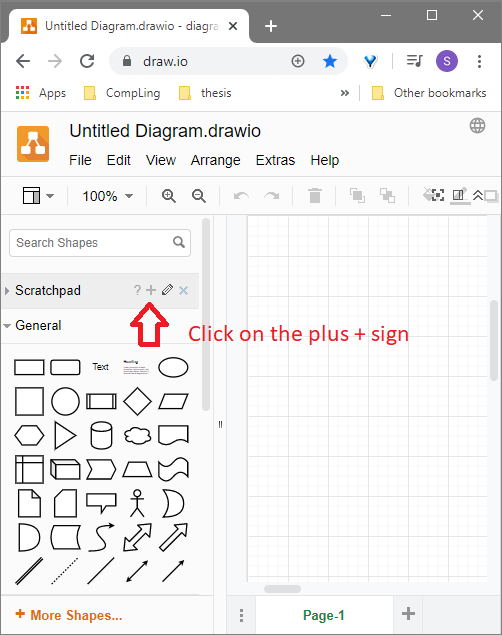
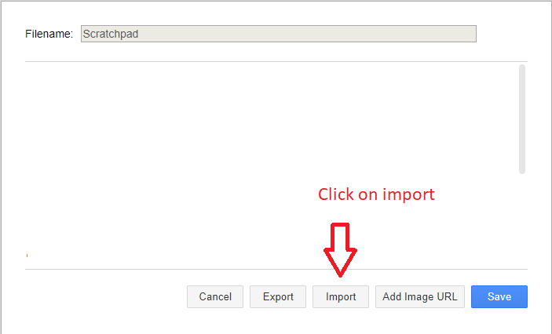
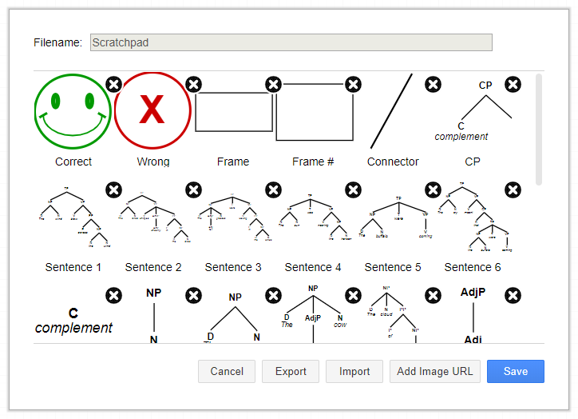
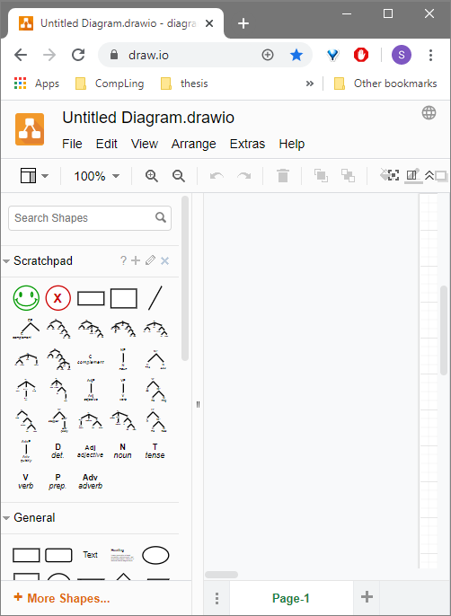
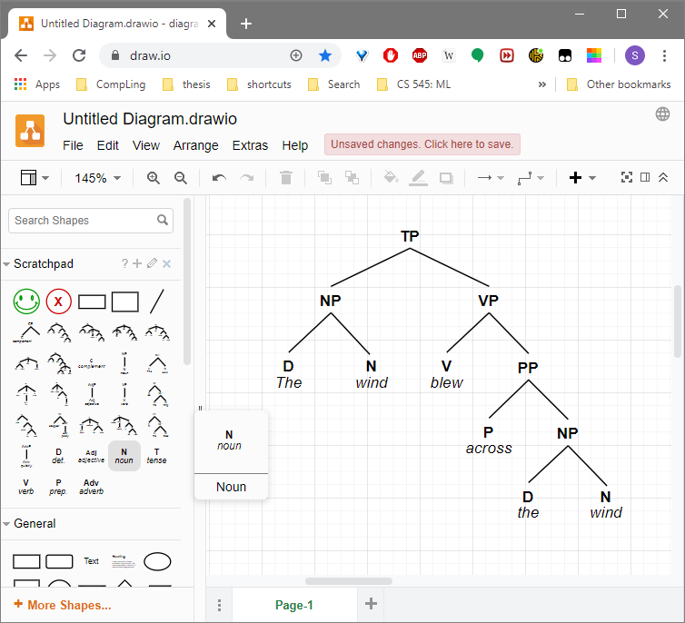
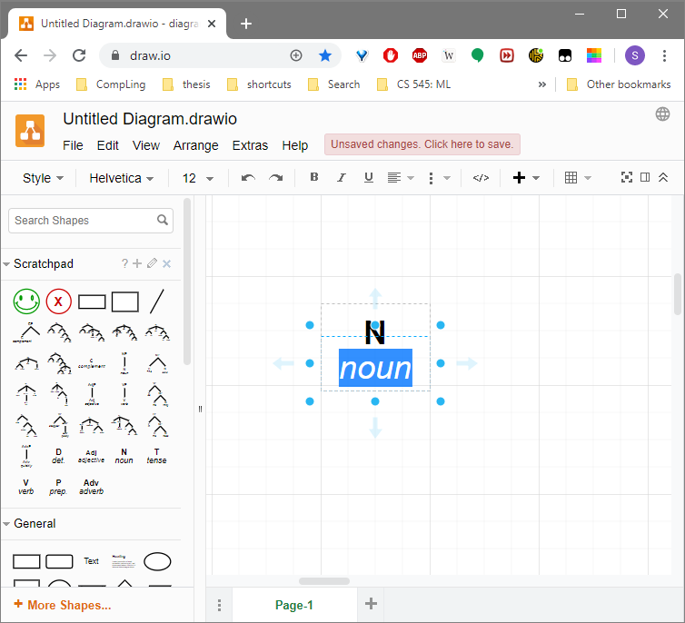

## LING 511: SYNTAX
Source code repository for Syntax taught at Portland State University.

### Syntax Tree Scratchpad for draw.io
You can find a scratchpad for drawing syntax trees for draw.io [here](https://github.com/steve3p0/LING511/blob/master/Draw.IO%20Syntax%20Scratchpad.xml).
Download the file and go to https://draw.io and open or create a new diagram.  Remember where you saved this file.
NOTE: Alternatively you can download and install the draw.io app on your local computer (https://www.diagrams.net/)

#### Import the Scratchpad
On the left-hand-side, click on the plus + sign on your Scratchpad.

Click on Import button.

Import the Scratchpad XML file that you downloaded from this source code repository (see above). 
You should see something like displayed below.

Click 'Save'.

You should now see the Syntax Scratchpad on the left side of the windows as shown below.

You can now drag and drop items from the Syntax Scratchpad onto the canvas of your diagram as shown below.

To fill in the words of the part-of-speech of your sentence, double click on the bottom half of a
part-of-speech tag that you have dropped onto your canvas as shown below.

Enjoy!

### NLTK Parse Tree Generator
Coming soon!

    
    
